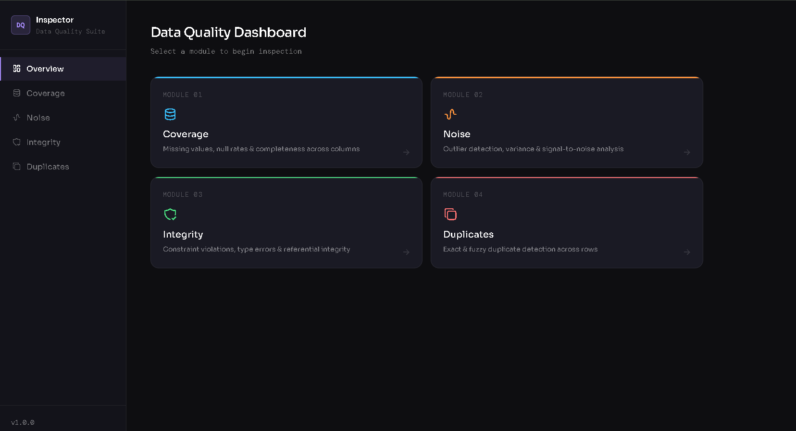
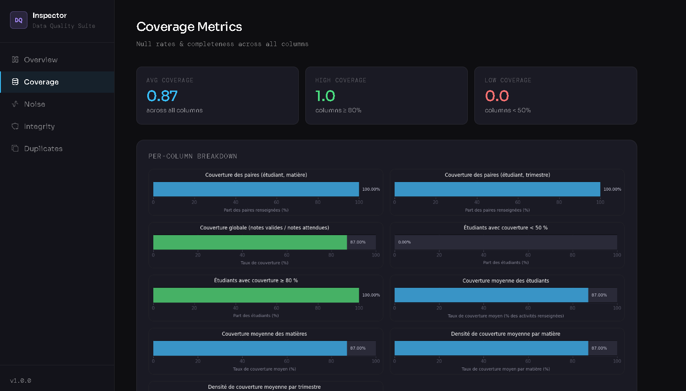
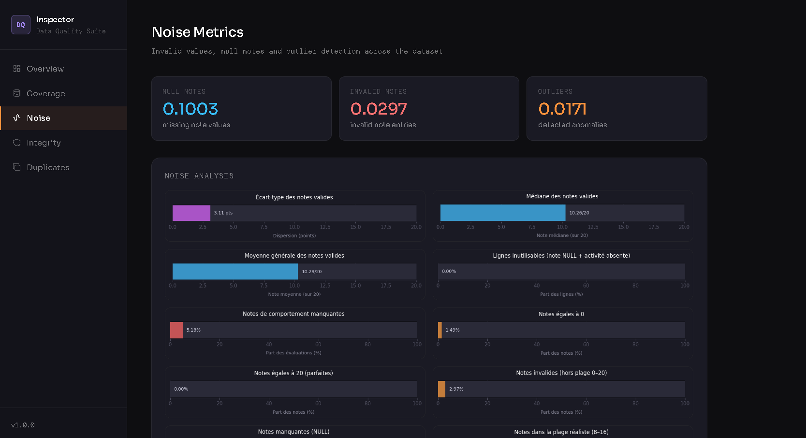
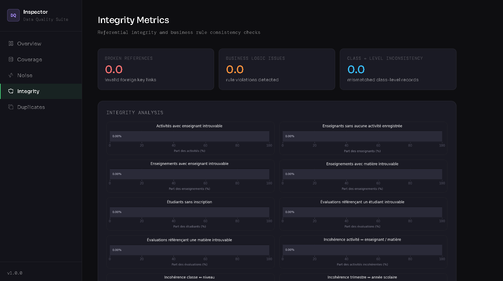
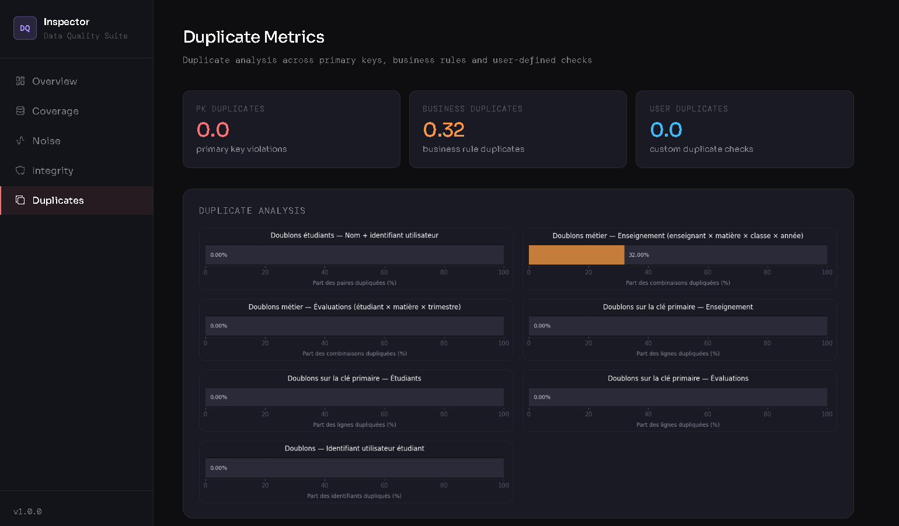
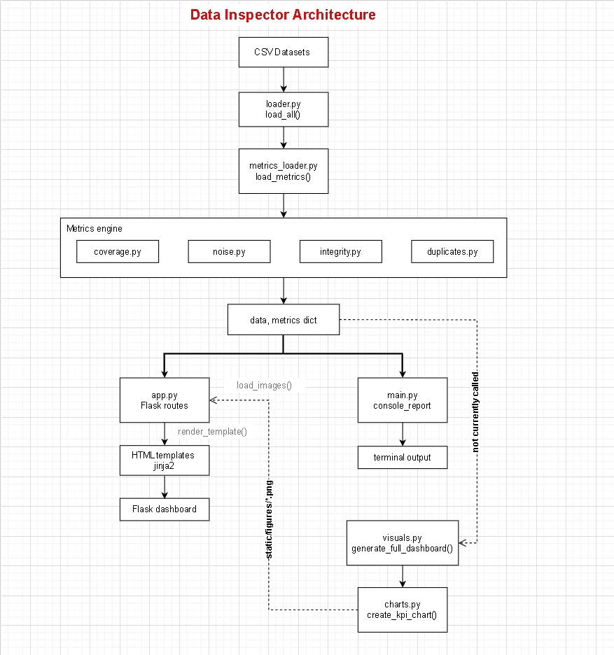
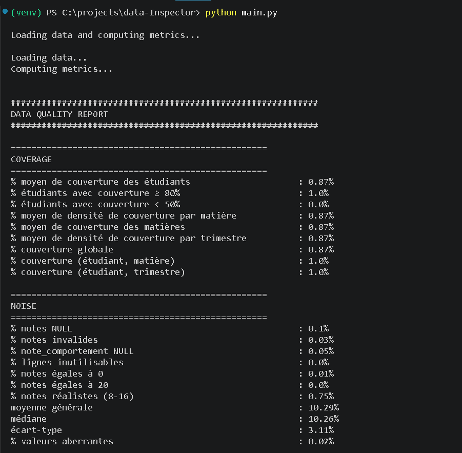
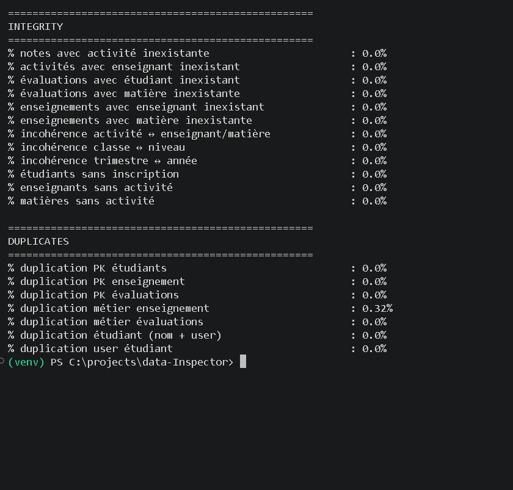

# 📊 Data Inspector

> **Un outil Python d'évaluation et de visualisation de la qualité des données pour les jeux de données éducatifs.**

<p align="center">


</p>

---

## 📖 Présentation

Data Inspector est une application Python conçue pour évaluer la qualité de jeux de données éducatifs à l'aide de métriques automatisées, de rapports visuels et d'un tableau de bord web interactif.

L'application a été développée pour répondre à un besoin rencontré lors de la réalisation d'une plateforme décisionnelle dédiée à la prédiction du rendement pédagogique des élèves. Avant d'intégrer les données dans le pipeline BI/ETL, il était indispensable d'identifier les problèmes de qualité, de guider les opérations de nettoyage, puis d'évaluer leur efficacité. Data Inspector automatise cette étape et peut désormais être utilisé comme un outil autonome d'inspection de la qualité des données.

Le projet analyse quatre dimensions fondamentales de la qualité des données :

- 📈 **Couverture**
- 🧹 **Bruit**
- 🔗 **Intégrité**
- 🧬 **Doublons**

Après le chargement des jeux de données, l'application calcule automatiquement les métriques de qualité, génère les visualisations, et affiche les résultats via une interface web Flask.

> ⚠️ **Remarque sur la structure des données :** le moteur de métriques attend un schéma relationnel spécifique (étudiants, activités, enseignants, matières, et enregistrements de notes/évaluations avec leurs relations). Pour réutiliser cet outil tel quel, votre jeu de données doit suivre une structure similaire — voir le [schéma](docs/schema.png) ci-dessous à titre de référence.

---
# 🗄️ Schéma des données

Le moteur de métriques de Data Inspector attend la structure relationnelle suivante. Pour réutiliser cet outil sur vos propres données, vos tables doivent suivre une forme similaire (les noms de colonnes peuvent différer, mais les relations doivent être respectées).

> **Légende :** <ins>souligné</ins> = clé primaire · `#champ` = clé étrangère

**Niveau** (<ins>id_niveau</ins>, nom_niveau)<br>
**Modules** (<ins>id_module</ins>, nom_module, coefficient_module, #id_niveau)<br>
**Matière** (<ins>id_matière</ins>, nom_matière, coefficient_matière, #id_module, #id_niveau)<br>
**Classe** (<ins>id_classe</ins>, nom_classe, #id_niveau)<br>
**Annee_scolaire** (<ins>id_annee</ins>, annee_label, date_debut, date_fin, active)<br>
**Trimestre** (<ins>id_trimestre</ins>, nom_trimestre, #id_annee, coefficient)

**Étudiants** (<ins>id_étudiant</ins>, nom_étudiant, #id_user)<br>
**Enseignant** (<ins>id_enseignant</ins>, nom_enseignant, #id_user)<br>
**Inscription** (<ins>id_inscription</ins>, #id_etudiant, #id_classe, #id_annee)<br>
**Enseignement** (<ins>id_enseignement</ins>, #id_enseignant, #id_matière, #id_classe, #id_annee)<br>
**Activité** (<ins>id_activité</ins>, #id_matière, #id_enseignant, nom_activité, coefficient_activité, #id_trimestre)

**Notes_activité** (<ins>#id_activité</ins>, <ins>#id_étudiant</ins>, note)<br>
**Evaluation** (<ins>id_eval</ins>, #id_etudiant, #id_matiere, #id_enseignant, #id_trimestre, satisfaction, note_comportement, commentaire, absence)

**Moyenne_matière** (<ins>#id_étudiant</ins>, <ins>#id_matière</ins>, <ins>#id_trimestre</ins>, moyenne_matière)<br>
**Moyenne_module** (<ins>#id_étudiant</ins>, <ins>#id_module</ins>, <ins>#id_trimestre</ins>, moyenne_module)<br>
**Moyenne_trimestrielle** (<ins>#id_étudiant</ins>, <ins>#id_trimestre</ins>, moyenne_trimestre)<br>
**Moyenne_annuelle** (<ins>#id_étudiant</ins>, <ins>#id_annee</ins>, moyenne_annuelle, décision)

**Authentification** (<ins>id_user</ins>, email, password, rôle, actif)<br>
**Admin_académique** (<ins>id_admin</ins>, nom_admin, #id_user)<br>
**Role** (<ins>id_role</ins>, nom_role, niveau_hierarchie)<br>
**Permission** (<ins>id_permission</ins>, nom_permission)<br>
**Rôle_permission** (<ins>#id_role</ins>, <ins>#id_permission</ins>)

**Relations clés utilisées par le moteur de métriques :**
- `Activité` relie une matière, un enseignant et un trimestre — c'est ce que vérifient les contrôles d'*intégrité* (cohérence activité ↔ enseignant/matière).
- `Enseignement` relie un enseignant, une matière, une classe et une année scolaire — les incohérences ici alimentent également les métriques d'*intégrité*.
- `Notes_activité` relie un étudiant à une activité via une note — table centrale pour les métriques de *bruit* (valeurs invalides/manquantes/aberrantes) et de *couverture* (quelles activités ont une note).
- `Inscription` et `Classe` établissent quels étudiants appartiennent à quelle classe/niveau pour une année donnée — utilisées pour calculer la couverture par classe et par niveau, et pour repérer les étudiants sans inscription valide.
- `Étudiants` et `Authentification` sont liées via `id_user` — c'est la base des contrôles de *doublons* sur l'identité étudiant/utilisateur.
---

## ✨ Fonctionnalités

- ✅ Chargement automatique des jeux de données éducatifs
- ✅ Calcul des métriques de qualité des données
- ✅ Visualisations individuelles des KPI
- ✅ Génération automatique des graphiques
- ✅ Tableau de bord Flask interactif
- ✅ Rapport de qualité en console
- ✅ Architecture modulaire du projet
- ✅ Moteur de métriques extensible

---

# 🧰 Outils de développement

En complément de l'application principale, le projet comprend plusieurs notebooks et outils destinés à faciliter le développement, les tests et les évolutions futures.

### 📊 Génération automatique des tableaux de bord

Le notebook `generate_dashboards.ipynb` permet de recalculer automatiquement l'ensemble des métriques de qualité puis de régénérer toutes les visualisations utilisées par l'application Flask. Il suffit de l'exécuter après une modification des données ou des métriques pour mettre à jour tous les graphiques.

### 🤖 Assistant de génération de rapports IA

Le notebook `ai_helper.ipynb` exploite un modèle d'intelligence artificielle via une API afin de produire automatiquement des rapports textuels à partir des métriques calculées. Cette fonctionnalité constitue une première étape vers une génération intelligente de rapports de qualité des données.

### 📓 Notebooks de développement des métriques

Des notebooks dédiés (`coverage.ipynb`, `noise.ipynb`, `integrity.ipynb` et `duplication.ipynb`) ont été utilisés pour concevoir, tester et valider indépendamment chaque famille de métriques avant leur intégration dans l'application.

---

# 🎬 Démo

L'animation suivante illustre le fonctionnement de l'application.

<p align="center">

</p>

---

# 📸 Captures d'écran

## Accueil

<p align="center">

</p>

---

## Tableau de bord — Couverture

<p align="center">

</p>

---

## Tableau de bord — Bruit

<p align="center">

</p>

---

## Tableau de bord — Intégrité

<p align="center">

</p>

---

## Tableau de bord — Doublons

<p align="center">

</p>

---

# 🏗️ Architecture

<p align="center">

</p>

### Pipeline de traitement

```text
CSV Datasets
      │
      ▼
Data Loader (loader.py)
      │
      ▼
Metrics Loader (metrics_loader.py)
      │
      ▼
Metrics Engine
  coverage · noise · integrity · duplicates
      │
      ▼
  data, metrics dict
      │
      ├──────────────────────────┐
      ▼                          ▼
Flask App (app.py)          Console Report (main.py)
      │                          │
      ▼                          ▼
HTML Templates              Terminal Output
      │
      ▼
Flask Dashboard (browser)


Chart Pipeline (currently disconnected — not called by app.py or main.py)

  metrics dict
      │
      ▼
Chart Generator (visuals.py → charts.py)
      │
      ▼
static/figures/*.png
      │
      · · · · · · · · read via load_images() · · · · · · · · ▶ Flask App (app.py)
```

Le projet suit une architecture modulaire où chaque composant est responsable d'une seule étape du flux de traitement de la qualité des données.

---

# 📋 Exemple de rapport console

Exemple de sortie générée par l'interface en ligne de commande.

<p align="center">


</p>

---

# 🛠️ Technologies

| Catégorie | Technologies |
|-----------|--------------|
| Langage | Python |
| Framework Web | Flask |
| Traitement des données | Pandas, NumPy |
| Visualisation | Matplotlib |
| Front-end | HTML, CSS, Bootstrap |
| Développement | Jupyter Notebook |

---

# 📂 Structure du projet

```text
data-inspector/
│
├── config/                             # Configuration générale du projet
│   └── paths.py                        # Gestion centralisée des chemins
│
├── data/
│   ├── raw/                            # Jeux de données sources
│   └── processed/                      # Jeux de données préparés
│
├── docs/                               # Documentation du projet
│   ├── architecture.png
│   ├── console-report.png
│   ├── demo.gif
│   └── screenshots/
│
├── notebooks/                          # Développement, expérimentation et outils
│   ├── setup.py                        # Initialisation de l'environnement des notebooks
│   ├── generate_dashboards.ipynb       # Génération automatique des graphiques
│   ├── ai_helper.ipynb                 # Génération assistée de rapports IA
│   ├── coverage.ipynb                  # Développement des métriques de couverture
│   ├── noise.ipynb                     # Développement des métriques de bruit
│   ├── integrity.ipynb                 # Développement des métriques d'intégrité
│   └── duplication.ipynb               # Développement des métriques de doublons
│
├── src/
│   │
│   ├── dashboards/                     # Tableau de bord Flask
│   │   ├── app.py                      # Point d'entrée de l'application web
│   │   ├── charts.py                   # Création des graphiques Matplotlib
│   │   ├── visuals.py                  # Export automatique des figures
│   │   │
│   │   ├── static/
│   │   │   ├── css/                    # Feuilles de style
│   │   │   ├── js/                     # Scripts JavaScript
│   │   │   └── figures/                # Graphiques générés
│   │   │
│   │   └── templates/                  # Templates HTML Flask
│   │
│   ├── metrics/                        # Calcul des métriques de qualité
│   │   ├── coverage.py
│   │   ├── noise.py
│   │   ├── integrity.py
│   │   └── duplicates.py
│   │
│   └── utils/
│       ├── loader.py                   # Chargement des jeux de données
│       ├── metrics_loader.py           # Calcul centralisé des métriques
│       └── ai_helper.py                # Fonctions utilitaires pour les rapports IA
│
├── main.py                             # Rapport qualité en ligne de commande
├── requirements.txt                    # Dépendances Python
├── README.md
└── LICENSE
```

---

# ⚙️ Installation

Cloner le dépôt.

```bash
git clone https://github.com/Adem20038/data-inspector.git
```

Se déplacer dans le répertoire du projet.

```bash
cd data-inspector
```

Installer les dépendances requises.

```bash
pip install -r requirements.txt
```

---

# 📁 Configuration des données

Pour des raisons de confidentialité, les données réelles des étudiants ne sont pas incluses dans ce dépôt — `data/raw/` et `data/processed/` sont exclus via `.gitignore`.

Pour exécuter ce projet, placez vos propres fichiers CSV dans `data/raw/`, en suivant le [schéma relationnel](#-schéma-des-données) décrit plus haut.

Les graphiques générés (`static/figures/`) sont également exclus, puisqu'il s'agit d'artefacts de build et non de fichiers source. Générez-les en suivant ces étapes :

#### 1. Lancer Jupyter Notebook depuis la racine du projet :

```bash
jupyter notebook
```

#### 2. Dans l'interface qui s'ouvre dans votre navigateur, naviguer vers :
```bash
notebooks/generate_dashboards.ipynb
```
#### 3. Ouvrir le notebook, puis exécuter toutes les cellules (menu **Cell → Run All**, ou **Kernel → Restart & Run All**).

Une fois ce notebook exécuté, `static/figures/` sera peuplé et `app.py` pourra servir le tableau de bord.

---

# 🚀 Utilisation

### Configurer l'API AI (obligatoire pour les fonctionnalités IA)

Ce projet utilise l'API Google Gemini via Google AI Studio.

#### 1. Créer un fichier `.env` à la racine du projet :

```env
GOOGLE_API_KEY=your_api_key_here
GEMINI_MODEL=your_gemini_model_here   
```

#### 2. Obtenir une clé API :
* Aller sur https://aistudio.google.com/
* Créer une API key
* Copier la clé dans `GOOGLE_API_KEY`

#### 3. Renseigner le modèle Gemini :
* Remplacer `your_gemini_model_here` par le nom exact du modèle à utiliser (ex : `gemini-1.5-flash` ou `gemini-1.5-pro`)
* La liste des modèles disponibles est consultable dans la [documentation officielle Google AI](https://ai.google.dev/gemini-api/docs/models)
### Générer les graphiques du tableau de bord

```bash
python generate_dashboard.py
```

### Lancer le tableau de bord Flask

```bash
python src/dashboards/app.py
```

### Générer le rapport console

```bash
python main.py
```

---

# 📊 Dimensions de la qualité des données

## 📈 Couverture

Évalue la complétude des dossiers scolaires en mesurant les informations manquantes et disponibles.

---

## 🧹 Bruit

Détecte les valeurs invalides, les notes manquantes, les valeurs aberrantes et les incohérences dans les données.

---

## 🔗 Intégrité

Identifie les références rompues et les violations de règles métier entre entités liées.

---

## 🧬 Doublons

Détecte les doublons de clés primaires, les doublons métier et les comptes utilisateurs dupliqués.

---
# 🎯 Objectifs du projet

## ✅ Version 1.0
- Métriques de qualité des données automatisées
- Tableau de bord web Flask
- Génération automatique du tableau de bord
- Rapport de qualité en console
- Documentation technique
- Publication sur GitHub en tant que projet de portfolio

---

## 🔄 Version 1.1
- Tableaux de bord interactifs avec Plotly
- Nouvelles visualisations (boîtes à moustaches, histogrammes, diagrammes circulaires)
- Amélioration de la présentation des KPI

---

## 🔄 Version 1.2
- Rapports de qualité au format PDF
- Export des métriques vers Excel
- Génération de rapports personnalisés

---

## 🔄 Version 1.3
- Support Docker
- API REST
- Gestion de la configuration

---

## 🔄 Version 2.0 (Vision)
- Détection d'anomalies par Machine Learning
- Score de qualité des données
- Intégration Power BI
- Pipeline CI/CD
- Déploiement Cloud

---

## 🧠 Compétences techniques démontrées
- Conception d'une architecture Python modulaire
- Développement de pipelines réutilisables pour le chargement des données et le calcul des métriques
- Implémentation de plusieurs métriques de qualité des données (Couverture, Bruit, Intégrité, Doublons)
- Automatisation de la génération du tableau de bord avec Matplotlib
- Développement d'une application web Flask pour la navigation interactive dans le tableau de bord
- Structuration du projet avec des modules utilitaires et de configuration réutilisables
- Documentation du projet avec des diagrammes d'architecture, des captures d'écran et une démo en direct

---

## 👨‍💻 À propos de l'auteur

**Adem Sghaier**<br>
Licence en Génie Logiciel et Systèmes d'Information<br>
Passionné par la création de logiciels, avec un intérêt particulier pour :

- Développement logiciel
- Data Engineering (BI, ML)
- IA

GitHub : https://github.com/Adem20038<br>
LinkedIn : https://www.linkedin.com/in/adem-sghaier485/<br>
Email : ademsghaier37@gmail.com

Ce projet a été conçu et développé de manière indépendante dans le cadre de mon portfolio d'ingénierie logicielle.

---

# 📄 Licence

Ce projet est distribué sous licence MIT.